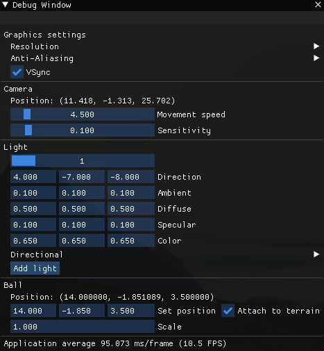

# **GolfGL**
[](https://github.com/djordjetane/GolfGL/actions/workflows/cmake.yml)  [](https://hub.docker.com/repository/docker/djordjetane/golfgl)

Cross-Platform Golf game in OpenGL. Faculty project for course Computer Graphics. <br>

|  |  |
| --- | --- |

# **Build**
> ### **Windows** 
> - Prerequisites: 
>     - [cmake](https://github.com/Kitware/CMake/releases/download/v3.20.0-rc2/cmake-3.20.0-rc2-windows-x86_64.msi)  binaries
>     - [Visual Studio](https://visualstudio.microsoft.com/downloads/#)
> ```
> > mkdir build && cd build  
> > cmake ..
> > cmake --build .
> > cd bin/GolfGL/$[Debug | Release]
> > GolfGL.exe
> ```
> ---
> ### **Linux (Debian based)**
> - Prerequisites:
> ```
> $ sudo apt install g++ cmake git build-essential libgl1-mesa-dev libsoil-dev libglm-dev libassimp-dev libglew-dev libglfw3-dev libxinerama-dev libxcursor-dev libxi-dev mesa-common-dev mesa-utils libxxf86vm-dev libfreetype6-dev
> ```
> ```
> $ mkdir build && cd build
> $ cmake ..
> $ make
> $ cd bin/GolfGL && ./GolfGL
> ```
> <br>

> ### **Docker**
> 
> [Docker image](https://hub.docker.com/repository/docker/djordjetane/golfgl)
> 
> <br>
---------------------------
## **Commands**

| ***Key*** | ***Action*** |
| ----------- | ----------- |
| ***Camera Movement*** |
| W | Forward |
| S | Back |
| A | Left |
| D | Right |
| ***Ball*** |
| Space | Shoot |
|  ***General***  |
| Esc | Exit |

## **Add on Features compared with original one**

- Supports motion blurred vision
- Supports camera following the ball
- Supports adjusting the ball speed